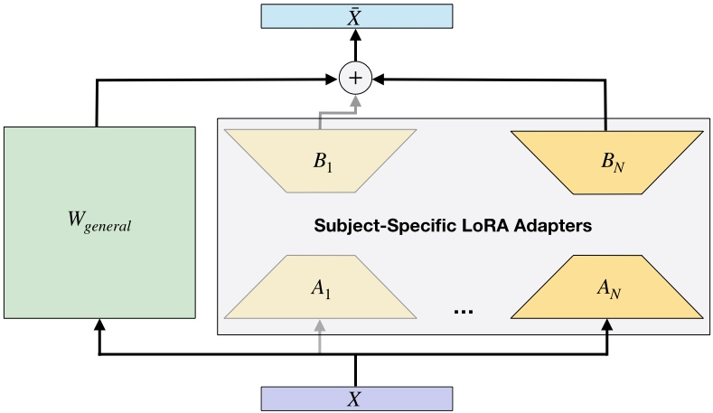

# Subject Conditioned Layer

This repository contains the code for reproducing or extending the **Subject Conditioned Layer** from our spotlight presentation at the [NeurIPS 2025 Workshop on Foundation Models for the Brain and Body](https://brainbodyfm-workshop.github.io/#home).

**Mitigating Subject Dependency in EEG Decoding with Subject-Specific Low-Rank Adapters**
<br>
Timon Klein, Piotr Minakowski & Sebastian Sager
<br>
[OpenReview](https://openreview.net/forum?id=vDtsuVfBmG)
<br>
[arXiv](https://arxiv.org/abs/2510.08059)


## 🧠 Overview
We propose **Subject-Conditioned Layer**, an adaptive layer designed as a drop-in replacement
for standard linear or convolutional layers in any neural network architecture. Our
layer captures subject-specific variability by decomposing its weights into a shared,
subject-invariant component and a lightweight, low-rank correction unique to each
subject. 


## 🏗️ Architecture Sketch


The input $X$ is processed by a shared general weight matrix $W_{\text{general}}$.  
For each subject, a subject-specific low-rank adapter, parameterized by matrices $A_s$ and $B_s$ of rank $r$, computes a correction that is added to the output of the general weight matrix, yielding the layer output $\bar{X}$.


## 🚀 Installation


### 1. Clone the repository
```bash
git clone https://github.com/timonkl/SubjectConditionedLayer.git
cd SubjectConditionedLayer
```


### 2. Create a virtual environment (recommended)
```bash
python -m venv venv
source venv/bin/activate      # On Linux/Mac
venv\Scripts\activate         # On Windows
```


### 3. Install dependencies
```bash
pip install -r requirements.txt
```


## 🧩 Usage
Our **SubjectModelWrapper** is a **lightweight and convenient drop-in module** that lets you adapt existing models to handle subject-conditioned learning with minimal code changes.  
Simply wrap your existing model and specify the number of subjects — no architecture redesign required.

```python
from subject_conditioned_layer.subject_conditioned_layer import SubjectModelWrapper

# Original model
base_model = BaseModel()

# Wrap it
num_subjects = 5
model = SubjectModelWrapper(base_model=base_model, num_subjects=num_subjects)

# Print to confirm that linear layers have been replaced
print(model)

# forward pass
x = torch.randn(4, 32) # batch_size x input_dim
subject_id = torch.randint(0, num_subjects, (4,)) # batch_size
out = model(x, subject_id)
```
A complete runnable example can be found in `subject_conditioned_layer/example.py`.
The research code used to reproduce the experiments from the paper is available in the `experiments/` folder.


## 📄 Citation
If you use this work, please cite our paper:

```bibtex
 @misc{klein2025mitigatingsubjectdependencyeeg,
      title={Mitigating Subject Dependency in EEG Decoding with Subject-Specific Low-Rank Adapters}, 
      author={Timon Klein and Piotr Minakowski and Sebastian Sager},
      year={2025},
      eprint={2510.08059},
      archivePrefix={arXiv},
      primaryClass={cs.LG},
      url={https://arxiv.org/abs/2510.08059}, 
}
```


## 🤝 Contributing
Contributions are welcome!
Please open an issue or pull request if you’d like to add features, fix bugs, or extend the model.